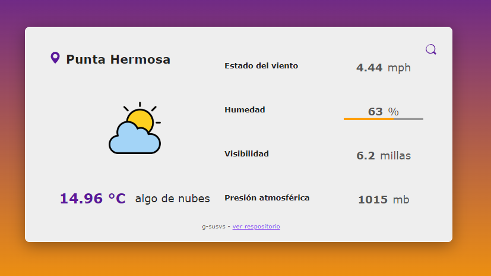

# Weather-App

Aplicación meteorológica, que utiliza servicios externos para obtener la geolocalización y los datos del clima.

Desarrollado con **Node.js** en del backend y en el frontend con **HTML**, **CSS** y **Javascript**.

## Configuraciones
<!-- <br></br> -->
Configurar las siguientes variables de entorno en un archivo `.env`.

```sh
MAPBOX_TOKEN="Your Mapbox token"
OW_APIKEY="Your Open Weather key"
```
El **MAPBOX_TOKEN** se obtiene de la api de [Mapbox](https://docs.mapbox.com/api/overview/).

El **OW_APIKEY** se obtiene de la api de [OpenWeather](https://openweathermap.org/api).


